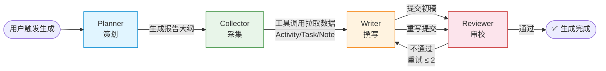

<div align="center">

# DayFlow

**基于 Spring AI 多智能体的个人日报 / 周报生成器**

记录工作与学习 → AI 编辑部协作撰写 → 自动生成结构化汇报

[](LICENSE)
[](https://spring.io/projects/spring-boot)
[](https://docs.spring.io/spring-ai/)
[](https://openjdk.org/)
[](https://vuejs.org/)
[](https://www.mysql.com/)

</div>

---

## 📖 项目简介

**DayFlow** 是一款开源的 AI 日报 / 周报生成器，采用「**编辑部模式**」的多智能体协作架构。它把繁琐的工作汇报自动化：你只需录入每天的活动、任务、学习笔记，4 个 AI Agent（策划 / 采集 / 撰写 / 审校）就会像真实编辑部一样分工协作，产出一份逻辑清晰、重点突出的日报或周报。

整个 Agent 协作过程通过 `agent_trace` 表完整记录，并在前端以时间线可视化——你能看到每个 Agent 的输入摘要、输出摘要、Token 消耗、耗时与重试次数，**AI 生成过程透明可追溯**。

### 它适合谁？

- 📝 每天被日报 / 周报占用时间的职场人
- 🎓 需要记录学习轨迹并定期复盘的学生
- 🤖 想学习 Spring AI 多智能体编排的开发者
- 🛠️ 寻找一个可二次开发的 AI 工作流脚手架的团队

---

## ✨ 核心特性

- **🤖 多智能体编辑部**：4 Agent 分工（Planner 策划 / Collector 采集 / Writer 撰写 / Reviewer 审校）+ 反馈循环（最多重试 2 次），模拟真实编辑部协作
- **🔄 异步生成 + 实时轮询**：报告生成是异步任务，前端轮询展示三态（生成中 / 已完成 / 失败），Agent 轨迹渐进式呈现
- **📊 协作过程可视化**：每个 Agent 的输入输出、Token、耗时、重试次数全程记录并以时间线展示
- **🔐 安全设计**：JWT 鉴权 + BCrypt 密码加密；雪花 ID 全链路精度保持（前端 json-bigint）；LLM 产出 HTML 经 DOMPurify 净化防 XSS；**LLM 全程不接触 userId**（经 ThreadLocal 传递）
- **🧩 可插拔 LLM**：默认 DeepSeek（云端），一键切换 Ollama（本地）， provider 由配置选择
- **📝 数据录入**：工作活动 / 学习笔记 / 内置待办三模块 CRUD，支持分类、标签、完成状态
- **🏛️ 分层架构**：严格 Controller-Service-Mapper 三层 + 统一 Result 包装 + 全局异常处理
- **✅ 测试完备**：后端三层测试（Mockito 单元 / @WebMvcTest 切片 / @SpringBootTest 集成），前端 Vitest 组件 / Store / 工具函数全覆盖

---

## 🛠️ 技术栈

### 后端（dayflow-server）

| 组件 | 版本 | 说明 |
| :--- | :--- | :--- |
| Spring Boot | 4.1.0 | 主线框架 |
| Spring AI | 2.0.0 | 多智能体编排（DeepSeek + Ollama） |
| Java | 21 (LTS) | |
| MyBatis-Plus | 3.5.15 | 数据持久层（Boot 4 专用 starter） |
| MySQL | 8.0 | utf8mb4 / InnoDB |
| jjwt | 0.12.6 | JWT 鉴权 |
| spring-security-crypto | - | BCrypt 密码加密（轻量引入，非完整 Security） |
| Lombok | - | 样板代码消除 |

### 前端（dayflow-web）

| 组件 | 版本 | 说明 |
| :--- | :--- | :--- |
| Vue | 3.5 | Composition API（`<script setup>`） |
| TypeScript | 5.6 | 类型安全 |
| Vite | 5.4 | 构建工具 |
| Pinia | 2.3 | 状态管理 |
| Vue Router | 4.5 | 路由 |
| Element Plus | 2.9 | UI 组件库 |
| axios | 1.7 | HTTP 客户端 |
| markdown-it + DOMPurify | 14 / 3 | Markdown 渲染 + XSS 净化 |
| json-bigint | 1 | 雪花 ID 精度保持 |
| Vitest | 2.1 | 单元测试 |

---

## 🏗️ 系统架构

### 多智能体编辑部模式

DayFlow 把报告生成抽象为一个「编辑部」工作流，4 个 Agent 各司其职，Revieweer 不通过时触发反馈循环，Writer 重写，直到通过或达到重试上限（最多 2 次）。



### 技术架构

```mermaid
flowchart TB
    subgraph 前端[dayflow-web · Vue3]
        UI[页面: 登录/录入/报告/历史]
        UI --> AX[axios + 拦截器]
    end

    subgraph 后端[dayflow-server · Spring Boot 4]
        Ctrl[Controller 薄层]
        Svc[Service 业务编排]
        Orch[ReportOrchestrationService<br/>多智能体编排]
        Tools[ReportDataTools<br/>@Tool 数据采集]
        Agent[4 Agent<br/>Planner/Collector/Writer/Reviewer]

        Ctrl --> Svc --> Orch
        Orch --> Agent
        Agent -.工具调用.-> Tools
        Tools --> Mapper
    end

    subgraph 数据[MySQL · dayflow]
        Mapper[MyBatis-Plus Mapper]
        Tables[(user / activity / task<br/>note / report / agent_trace)]
        Mapper --> Tables
    end

    subgraph LLM[LLM Provider]
        DS[(DeepSeek 云端)]
        OL[(Ollama 本地)]
    end

    AX <-->|REST /api| Ctrl
    Agent <-->|ChatClient| DS
    Agent <-.可切换.-> OL
    Orch -->|写轨迹| Tables
```

---

## 📁 项目结构

```
DayFlow/
├── dayflow-server/                    # 后端 Spring Boot 服务
│   └── src/main/java/com/dayflow/
│       ├── controller/                # 薄层：参数校验 + 调 Service + Result 包装
│       ├── service/                   # 厚层：业务编排、实体转换、事务
│       │   └── impl/                  # 接口在 service/，实现在 impl/
│       ├── agent/                     # 多智能体核心
│       │   ├── orchestration/         # ReportOrchestrationService 编排
│       │   ├── planner/               # 策划 Agent
│       │   ├── collector/             # 采集 Agent
│       │   ├── writer/                # 撰写 Agent
│       │   ├── reviewer/              # 审校 Agent
│       │   └── tools/                 # ReportDataTools（@Tool 数据采集）
│       ├── mapper/                    # MyBatis-Plus Mapper
│       ├── pojo/                      # 数据模型
│       │   ├── entity/                # 实体类（Entity 后缀）
│       │   ├── dto/                   # 入参（DTO 后缀）
│       │   ├── query/                 # 查询条件（Query 后缀）
│       │   └── vo/                    # 出参（VO 后缀）
│       ├── config/                    # MyBatis-Plus / Web / AI 配置
│       └── common/                    # Result / ResultCode / 异常 / 常量
│
├── dayflow-web/                       # 前端 Vue3 应用
│   └── src/
│       ├── api/                       # API 请求层（axios 实例 + 各业务 api）
│       ├── components/                # 通用组件（MarkdownView / AgentTimeline）
│       ├── composables/               # 组合式函数（useReportPolling）
│       ├── layouts/                   # 布局（AppLayout 侧边栏）
│       ├── router/                    # 路由 + 鉴权守卫
│       ├── stores/                    # Pinia（authStore / reportStore）
│       ├── types/                     # TypeScript 类型定义
│       ├── utils/                     # 工具函数
│       └── views/                     # 页面（auth / input / report / history）
│
├── init.sql                           # 数据库初始化脚本（手动初始化用）
└── LICENSE                            # MIT
```

---

## 🚀 快速开始

### 环境要求

| 依赖 | 版本 | 说明 |
| :--- | :--- | :--- |
| JDK | 21+ | 必须 |
| Maven | 3.9+ | 后端构建 |
| Node.js | 18+ | 前端构建 |
| MySQL | 8.0+ | 数据存储 |
| DEEPSEEK_API_KEY | - | 使用 DeepSeek 时必需（或改用本地 Ollama） |

### 1. 克隆仓库

```bash
git clone https://github.com/jiaxianming/DayFlow.git
cd DayFlow
```

### 2. 启动数据库

DayFlow 启动时会**自动建库建表**（`spring.sql.init.mode=always` + 幂等 DDL），你只需确保 MySQL 运行中、连接账号有建库权限。默认连接 `localhost:3306`，账号 `root/root`。

如需手动初始化，可执行根目录脚本：

```bash
mysql -u root -p < init.sql
```

### 3. 配置并启动后端

在 `dayflow-server` 目录或通过环境变量配置（DeepSeek 为默认 provider）：

```bash
# 必需：DeepSeek API Key（云端默认方案）
export DEEPSEEK_API_KEY=sk-your-key-here

# 可选：覆盖默认配置
export DAYFLOW_DB_USER=root           # 数据库用户（默认 root）
export DAYFLOW_DB_PASSWORD=root       # 数据库密码（默认 root）
export DAYFLOW_JWT_SECRET=your-secret # JWT 密钥（生产必改）
```

> 💡 **想用本地 Ollama？** 设置 `export DAYFLOW_AI_PROVIDER=ollama` 即可切换（默认连本地 `localhost:11434`，模型 `qwen2.5`）。

启动后端：

```bash
mvn -f dayflow-server/pom.xml spring-boot:run
```

后端默认运行在 `http://localhost:8080`。

### 4. 启动前端

```bash
cd dayflow-web
npm install
npm run dev
```

前端默认运行在 `http://localhost:5173`，已配置代理将 `/api` 转发到后端 8080。

### 5. 开始使用

浏览器打开 `http://localhost:5173`，使用预置账号登录：

| 账号 | 密码 |
| :--- | :--- |
| `admin` | `dayflow123` |

也可注册新账号。登录后录入活动 / 笔记 / 待办，再到「报告中心」生成日报或周报。

---

## ⚙️ 配置说明

所有配置均可通过环境变量覆盖，以下是完整清单：

| 环境变量 | 默认值 | 说明 |
| :--- | :--- | :--- |
| `DEEPSEEK_API_KEY` | （空） | DeepSeek API Key，使用云端方案时必需 |
| `DAYFLOW_AI_PROVIDER` | `deepseek` | LLM provider：`deepseek`（云端）/ `ollama`（本地）/ `none` |
| `DAYFLOW_DEEPSEEK_MODEL` | `deepseek-v4-flash` | DeepSeek 模型名 |
| `DAYFLOW_OLLAMA_BASE_URL` | `http://localhost:11434` | Ollama 服务地址 |
| `DAYFLOW_OLLAMA_MODEL` | `qwen2.5` | Ollama 模型名 |
| `DAYFLOW_DB_USER` | `root` | 数据库用户名 |
| `DAYFLOW_DB_PASSWORD` | `root` | 数据库密码 |
| `DAYFLOW_JWT_SECRET` | （内置 dev 值） | JWT 签名密钥，**生产环境务必覆盖** |

---

## 🗄️ 数据库设计

共 6 张表，全部使用雪花 ID（BIGINT）+ `utf8mb4` / `InnoDB`：

| 表名 | 说明 | 关键字段 |
| :--- | :--- | :--- |
| `user` | 用户 | username（唯一）、password_hash（BCrypt） |
| `activity` | 工作活动 | content、category（WORK/STUDY/MEETING/OTHER）、occurred_at |
| `task` | 内置待办 | title、status（TODO/DOING/DONE）、completed_at |
| `note` | 学习笔记 | title、content、tags |
| `report` | 报告 | type（DAILY/WEEKLY）、status（GENERATING/GENERATED/FAILED）、content（Markdown）、token_usage |
| `agent_trace` | Agent 执行轨迹 | report_id、agent_name、step、input/output_summary、tokens、latency_ms、retry_count |

完整建表语句见 [`init.sql`](init.sql)。

---

## 📡 API 概览

所有接口统一前缀 `/api`，返回 `Result<T>` 包装（`code` / `msg` / `data`，成功 `code=200`）。

| 模块 | 方法 | 路径 | 说明 |
| :--- | :--- | :--- | :--- |
| 鉴权 | POST | `/api/auth/login` | 登录，返回 JWT |
| 鉴权 | POST | `/api/auth/register` | 注册 |
| 活动 | GET/POST/PUT/DELETE | `/api/activities` | 活动 CRUD + 分页 |
| 待办 | GET/POST/PUT/DELETE | `/api/tasks` | 待办 CRUD + 分页 |
| 待办 | PATCH | `/api/tasks/{id}/complete` | 标记完成 |
| 笔记 | GET/POST/PUT/DELETE | `/api/notes` | 笔记 CRUD + 分页 |
| 报告 | GET/DELETE | `/api/reports` | 报告分页 / 详情 / 删除 |
| 报告 | POST | `/api/reports/generate` | **触发生成**（异步） |
| 报告 | GET | `/api/reports/{id}/traces` | Agent 协作轨迹 |
| 系统 | GET | `/api/health` | 健康检查 |

> 接口文档（OpenAPI 3 / Swagger UI）计划在 M5 开源工程化阶段引入 springdoc 后提供。

---

## 🧪 测试

### 后端

三层测试体系，沿用 TDD：

```bash
mvn -f dayflow-server/pom.xml test
```

- **单元测试**：Mockito 隔离 Service / Agent 逻辑
- **切片测试**：`@WebMvcTest` 验证 Controller 层（含参数校验、异常映射）
- **集成测试**：`@SpringBootTest` 端到端（真实 MySQL + BCrypt + JWT）

### 前端

```bash
cd dayflow-web
npm test            # 单次运行
npm run typecheck   # vue-tsc 类型检查
npm run build       # 生产构建
```

覆盖 authStore、路由守卫、axios 拦截器（雪花 ID 解析 / Result 解包 / 401 处理）、报告轮询、Markdown 净化、Agent 时间线、各页面组件。

---

## 🗺️ 路线图

DayFlow 采用里程碑式迭代开发：

| 里程碑 | 内容 | 状态 |
| :--- | :--- | :--- |
| **M0** | 项目骨架与通用基建（Maven / Result / 异常处理 / 健康检查） | ✅ 完成 |
| **M1** | 数据层 CRUD（6 表 + 4 资源 CRUD + JWT 鉴权） | ✅ 完成 |
| **M2** | Spring AI 接入（DeepSeek / Ollama 可插拔） | ✅ 完成 |
| **M3** | 多智能体核心（4 Agent + 反馈循环 + agent_trace） | ✅ 完成 |
| **M4** | 前端 Web（Vue3 全功能界面 + 协作可视化） | ✅ 完成 |
| **M5** | 开源工程化（Docker / CI/CD / 文档站 / 部署） | 🔜 规划中 |

---

## 🤝 贡献指南

欢迎提交 Issue 和 Pull Request！贡献前请阅读以下约定：

1. **Fork 仓库**并创建特性分支：`feature/<milestone>-<topic>`
2. **遵循分层架构**：Controller 只做参数校验 + 调 Service + Result 包装，业务逻辑下沉 Service
3. **命名规范**：实体 `Entity` 后缀、入参 `DTO`、出参 `VO`、查询 `Query`
4. **测试先行**：新功能必须附带测试（后端三层、前端 Vitest）
5. **提交规范**：使用[约定式提交](https://www.conventionalcommits.org/zh-hans/)（`feat` / `fix` / `docs` / `refactor` / `test` / `chore`）
6. **代码即文档**：关键代码包含清晰的中文注释，公开类 / 方法有 JavaDoc（`@author jiaxianming`）

提交 PR 前请确保 `mvn test` 与 `npm test` 全部通过。

---

## 📄 开源协议

本项目基于 [MIT License](LICENSE) 开源，© 2026 jiaxianming。

可自由使用、修改和分发，请保留原始版权声明。

---

<div align="center">

**如果这个项目对你有帮助，欢迎 ⭐ Star 支持！**

</div>
