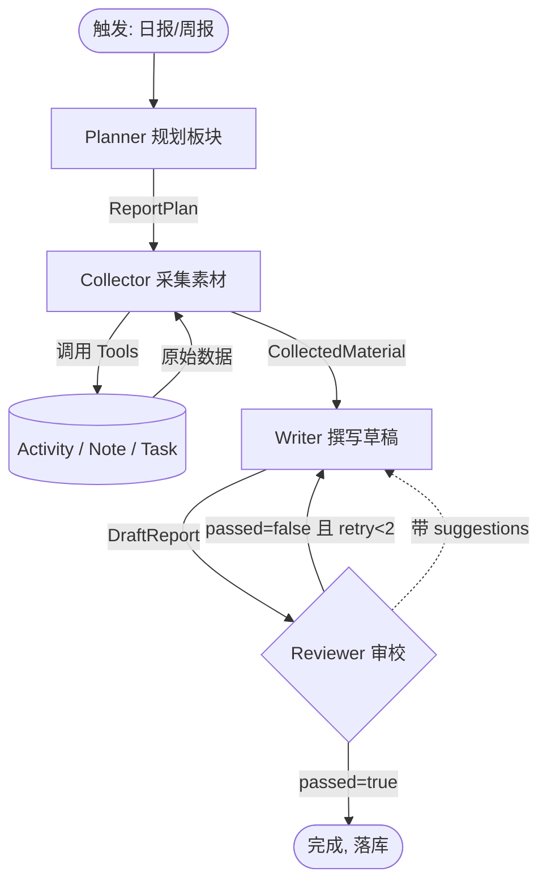

# DayFlow —— AI 日报/周报生成器 设计文档

| 项目 | 内容 |
|------|------|
| 文档日期 | 2026-07-07 |
| 状态 | 待审查 |
| 技术主体 | Spring Boot 3.3 + Spring AI 1.0 + Vue3 + MySQL 8 + Java 21 |

---

## 1. 项目定位

**DayFlow** 是一个基于 Spring AI 多智能体的个人日报/周报生成器。用户在日常录入工作活动与学习笔记后，多个 AI Agent 像编辑部一样协作，自动产出结构化、可读性强的日报/周报。

**一句话定位**：用户记录每日的工作与学习，多个 AI Agent 协作产出高质量日报/周报。

**报告内容范围**：工作汇报型 + 学习日报型（混合）。即每天的内容既包含"今天做了什么工作"，也包含"今天学到了什么"。

### 1.1 为什么"不是 demo"（开源竞争力点）

- 真·多智能体：4 个 Agent + 反馈循环（非单次 prompt）
- Tool Calling：Collector Agent 通过工具调用拉取业务数据（展示 Spring AI 工具能力）
- 结构化输出 + 学习笔记 RAG 语义检索
- Agent 执行轨迹可视化（`agent_trace` 表 + 前端协作时间线）
- 前后端分离 + 数据持久化 + 模型可插拔
- 完整工程化：README、docker-compose 一键运行、CI、文档

---

## 2. 目标与非目标

### 2.1 本期（MVP）目标

- 支持用户录入工作活动、学习笔记、待办任务
- 基于编辑部模式的多智能体协作生成日报/周报
- 日报/周报的查看、历史管理
- Agent 协作过程可视化
- 模型可插拔（默认 DeepSeek，支持 Ollama 本地）
- docker-compose 一键运行

### 2.2 非目标（本期不做，留待后续版本）

- **Git 提交记录**作为数据源（用户明确：当前版本不做，后续版本再支持）
- 外部任务系统集成（Jira / GitHub Issues）——本期为内置轻量待办
- 团队/多租户协作（本期为单用户登录即可）
- 移动端原生 App
- 多语言界面

---

## 3. 整体架构

```
┌─────────────────────────────────────────────────────────────┐
│                    前端 (Vue3 + TS + Vite)                    │
│   录入页(活动/学习/任务)  ·  报告查看页  ·  历史/设置         │
└──────────────────────────┬──────────────────────────────────┘
                           │ REST API (JSON)
┌──────────────────────────▼──────────────────────────────────┐
│              后端 (Spring Boot 3.3 + Spring AI 1.0)          │
│  ┌─────────────┐   ┌──────────────────────────────────────┐ │
│  │ Controller  │──▶│         Report Service (编排)          │ │
│  │ (薄层)      │   │  触发日报/周报生成、管理报告生命周期   │ │
│  └─────────────┘   └───────────────┬──────────────────────┘ │
│                                    │                         │
│           ┌────────────────────────▼────────────────────────┐│
│           │      多智能体编排层 (Spring AI ChatClient)        ││
│           │  Planner ──▶ Collector ──▶ Writer ──▶ Reviewer   ││
│           │   规划        采集(Tool)    撰写     审校(回退)   ││
│           └───────────────┬──────────────┬────────────────────┘│
│                           │              │                     │
│           ┌───────────────▼────────┐  ┌──▼──────────────┐    │
│           │  业务 Service 层        │  │ Spring AI Tools  │   │
│           │ (活动/笔记/任务/报告CRUD)│  │(暴露给 Collector)│   │
│           └────────┬───────────────┘  └──────────────────┘   │
└────────────────────┼─────────────────────────────────────────┘
                     │
┌────────────────────▼─────────────────────────────────────────┐
│   MySQL 8 (业务数据)  ·  Redis Stack (向量库, 笔记 RAG)        │
│   LLM Provider: OpenAI 兼容(DeepSeek/通义) / Ollama(本地)     │
└──────────────────────────────────────────────────────────────┘
```

---

## 4. 技术栈

| 层 | 选型 | 理由 |
|----|------|------|
| JDK | Java 21 | LTS，Spring Boot 3 要求 17+ |
| 构建 | Maven 3.9 | 本机已装（无 Gradle） |
| 后端框架 | Spring Boot 3.3.x + Spring AI 1.0.x | 用户指定 Spring AI |
| ORM | MyBatis-Plus | 遵循全局开发规范 |
| 数据库 | MySQL 8 | 与 MyBatis-Plus 常规搭配 |
| 向量库 | Redis Stack（Spring AI RedisVectorStore） | 笔记 RAG 检索，单机够用 |
| 前端 | Vue3 + TS + Vite + Pinia + Element Plus | 遵循全局前端规范 |
| LLM | 可插拔：OpenAI 兼容协议为主，示例配 DeepSeek；支持 Ollama 本地 | 国内外都能跑 |

---

## 5. 多智能体协作设计（核心）

采用**编辑部模式**：4 个 Agent 各自配置独立的 `ChatClient`（专属 system prompt），通过**结构化对象**传递数据，而非自由文本。

### 5.1 Agent 规格

#### Planner（主编 · 规划）

- **输入**：日期范围、当天数据量预估、报告类型（DAILY / WEEKLY）
- **输出**：`ReportPlan`（结构化）
- **职责**：决定报告分几个板块、每块用哪个数据源、重点是什么

```java
/**
 * 报告规划，由 Planner Agent 产出
 */
public class ReportPlan {
    /** 报告标题，例如 "2026-07-07 工作与学习日报" */
    private String title;
    /** 板块清单 */
    private List<PlanSection> sections;
}

public class PlanSection {
    /** 板块名，例如 "今日工作进展" */
    private String name;
    /** 数据源：ACTIVITY / NOTE / TASK */
    private String dataSource;
    /** 该板块要突出的重点 */
    private String focus;
}
```

#### Collector（采集记者 · Tool Calling）

- **输入**：`ReportPlan` + 日期范围
- **输出**：`CollectedMaterial`（结构化素材包）
- **职责**：根据 Planner 指派的板块，**调用工具**拉取数据，去重归类
- **关键**：通过 Spring AI `@Tool` 调用业务 Service（展示"Agent 调用外部工具"）

```java
/**
 * 报告数据采集工具，注册给 Collector Agent
 */
@Component
public class ReportDataTools {

    @Tool(description = "查询指定日期范围内的用户工作活动记录")
    public List<Activity> listActivities(String startDate, String endDate) { ... }

    @Tool(description = "基于关键词检索相关学习笔记片段（语义检索）")
    public List<NoteChunk> searchNotes(String query, String dateRange) { ... }

    @Tool(description = "查询指定日期范围内完成的任务")
    public List<Task> listCompletedTasks(String start, String end) { ... }
}
```

Collector 将工具返回结果归纳为 `CollectedMaterial`。

#### Writer（撰稿编辑 · 撰写）

- **输入**：`ReportPlan` + `CollectedMaterial` +（可选）上轮 Reviewer 建议
- **输出**：`DraftReport`（草稿，分板块）
- **职责**：把素材写成通顺、有重点、不啰嗦的中文段落，严格按 Planner 的板块结构

#### Reviewer（审校 · 质检 + 反馈循环）

- **输入**：`DraftReport` + 原始 `CollectedMaterial`
- **输出**：`ReviewResult`

```java
public class ReviewResult {
    /** 是否通过 */
    private boolean passed;
    /** 问题清单 */
    private List<ReviewIssue> issues;
    /** 给 Writer 的修改建议（未通过时） */
    private String suggestions;
}
```

- **核心校验**：
  1. **素材依据**：草稿里的表述必须在素材中有依据（去夸大、去臆造）
  2. **去重复**：板块间不重复啰嗦
  3. **板块完整性**：Planner 规划的板块都已覆盖
  4. **语气**：客观、专业、不浮夸

### 5.2 编排流程

编排层 = `ReportOrchestrationService`，负责串联 4 个 Agent、管理反馈循环、落库与轨迹记录。



### 5.3 反馈循环机制（"多智能体"的灵魂）

```java
/**
 * 日报生成主流程（编排层，简化表达）
 */
public Report generateDailyReport(Long userId, LocalDate date) {
    Report report = createReport(userId, ReportType.DAILY, date);
    try {
        // 1. 规划
        ReportPlan plan = plannerAgent.plan(buildPlanInput(userId, date));
        agentTraceService.trace(report.getId(), AgentName.PLANNER, plan);

        // 2. 采集
        CollectedMaterial material = collectorAgent.collect(plan, date);
        agentTraceService.trace(report.getId(), AgentName.COLLECTOR, material);

        // 3. 撰写 + 审校（带反馈循环，最多重试 MAX_RETRY 次）
        int retry = 0;
        DraftReport draft = writerAgent.write(plan, material, null);
        agentTraceService.trace(report.getId(), AgentName.WRITER, draft, retry);

        while (retry < MAX_RETRY) {
            ReviewResult review = reviewerAgent.review(draft, material);
            agentTraceService.trace(report.getId(), AgentName.REVIEWER, review, retry);
            if (review.isPassed()) {
                break;
            }
            retry++;
            draft = writerAgent.write(plan, material, review.getSuggestions());
            agentTraceService.trace(report.getId(), AgentName.WRITER, draft, retry);
        }

        // 4. 落库
        report.setContent(draft.toMarkdown());
        report.setStatus(ReportStatus.GENERATED);
    } catch (Exception e) {
        report.setStatus(ReportStatus.FAILED);
        report.setErrorMsg(e.getMessage());
    }
    return save(report);
}
```

`MAX_RETRY = 2`：平衡质量与成本，最多让 Writer 返工 2 次，之后强制通过。

### 5.4 日报 vs 周报差异

| | 日报 | 周报 |
|---|------|------|
| 数据范围 | 当天 | 本周 7 天 |
| Planner 重点 | 今日做了/学了什么 | 周度总结、趋势、成果归纳 |
| 额外输入 | — | 复用本周已生成的日报作为素材（不重新全量生成） |

### 5.5 Spring AI 实现要点

- **ChatClient 多实例**：`plannerChatClient` / `collectorChatClient` / `writerChatClient` / `reviewerChatClient`，各自 `.defaultSystem(prompt)`
- **结构化输出**：`.entity(ReportPlan.class)` / `BeanOutputConverter`
- **Tool Calling**：Collector 的 `ChatClient` 注册 `ReportDataTools`
- **RAG**：学习笔记切块入 Redis 向量库，`searchNotes` 工具做语义检索
- **审计 Advisor**：全局加日志 Advisor，记录每个 Agent 的输入/输出/token

---

## 6. 数据模型

实体命名遵循全局规范：**必须使用 `Entity` 后缀**（如 `UserEntity`、`ActivityEntity`、`ReportEntity`）。所有主键 `@TableId(type = IdType.ASSIGN_ID)`，所有字段显式 `@TableField`。

### 6.1 `user` —— 用户

| 字段 | 类型 | 说明 |
|------|------|------|
| id | bigint (PK) | 雪花 ID |
| username | varchar(64) | 登录名，唯一 |
| nickname | varchar(64) | 昵称 |
| password_hash | varchar(128) | BCrypt |
| created_at | datetime | |

### 6.2 `activity` —— 工作活动

| 字段 | 类型 | 说明 |
|------|------|------|
| id | bigint (PK) | |
| user_id | bigint | |
| content | text | 活动描述 |
| category | varchar(16) | WORK / STUDY / MEETING / OTHER |
| occurred_at | datetime | 发生时间 |
| created_at | datetime | |

### 6.3 `task` —— 内置轻量待办

| 字段 | 类型 | 说明 |
|------|------|------|
| id | bigint (PK) | |
| user_id | bigint | |
| title | varchar(200) | |
| status | varchar(16) | TODO / DOING / DONE |
| completed_at | datetime | 完成时间（供周报统计） |
| created_at | datetime | |

### 6.4 `note` —— 学习笔记

| 字段 | 类型 | 说明 |
|------|------|------|
| id | bigint (PK) | |
| user_id | bigint | |
| title | varchar(200) | |
| content | mediumtext | 原文 |
| tags | varchar(200) | 逗号分隔 |
| created_at | datetime | |

> 笔记正文按 ~300 字切块 + embedding 入 Redis 向量库；`note` 表只存元信息与原文。

### 6.5 `report` —— 报告

| 字段 | 类型 | 说明 |
|------|------|------|
| id | bigint (PK) | |
| user_id | bigint | |
| type | varchar(8) | DAILY / WEEKLY |
| period_start | date | 周期起 |
| period_end | date | 周期止 |
| title | varchar(200) | |
| content | mediumtext | 最终 Markdown |
| status | varchar(16) | GENERATING / GENERATED / FAILED |
| error_msg | varchar(500) | 失败原因 |
| token_usage | int | 总 token |
| created_at | datetime | |

### 6.6 `agent_trace` —— Agent 执行轨迹（开源亮点）

把每次 4 个 Agent 的协作过程结构化存下来，前端可视化展示协作时间线。

| 字段 | 类型 | 说明 |
|------|------|------|
| id | bigint (PK) | |
| report_id | bigint | 关联报告 |
| agent_name | varchar(16) | PLANNER / COLLECTOR / WRITER / REVIEWER |
| step | int | 第几步 |
| input_summary | text | 入参摘要 |
| output_summary | text | 出参摘要 |
| tokens | int | |
| latency_ms | int | |
| retry_count | int | 默认 0 |
| created_at | datetime | |

**合计 6 张业务表 + 1 个 Redis 向量集合。**

---

## 7. 核心数据流

### 7.1 录入流

```
前端录入页 ──▶ ActivityController(薄层,校验)
                  └─▶ ActivityService ──▶ MySQL.activity
              NoteController
                  └─▶ NoteService ──▶ MySQL.note
                                  └─▶ 切块 + embedding ──▶ Redis 向量库
              TaskController
                  └─▶ TaskService ──▶ MySQL.task
```

### 7.2 报告生成流（核心）

```
前端[生成日报] ──▶ ReportController
                      └─▶ ReportService.generateDailyReport(userId, date)
                            └─▶ ReportOrchestrationService.run(...)
                                   ├─ 创建 report(status=GENERATING)
                                   ├─ Planner     ─▶ 写 agent_trace
                                   ├─ Collector(调 Tools 取 activity/task/note) ─▶ agent_trace
                                   ├─ Writer      ─▶ agent_trace
                                   ├─ Reviewer(可能回退 Writer) ─▶ agent_trace
                                   └─ report.content = 最终稿, status=GENERATED
                      ◀─ 返回 report(含 agent_trace)
```

### 7.3 查看流

前端拉 `report` + 关联 `agent_trace`：报告主区显示 Markdown，侧边/折叠区显示 4 个 Agent 的协作时间线。

---

## 8. 错误处理与降级

每一个功能点覆盖正常路径、空数据、异常错误三种情况。

| 场景 | 处理 |
|------|------|
| LLM 调用失败/超时 | Spring AI `RetryTemplate` 重试 3 次；仍失败 → `status=FAILED`，记录 `error_msg`，前端友好提示 |
| 当天无数据（空数据） | Collector 返回空 → Planner 产出"今日暂无记录"轻量模板，不崩溃，提示用户录入 |
| Reviewer 反馈超 maxRetry(2) | 强制通过当前草稿，`agent_trace` 记录 `retry_count` |
| token 超限 | Collector 按板块分批取素材并摘要压缩，避免单次超长 |
| 笔记 RAG 检索失败 | 降级为标签/关键词匹配；再失败则跳过笔记板块 |
| Tool 调用异常 | 单个工具失败不影响整体，Collector 记录"某源不可用"并继续 |
| 全局异常 | `@RestControllerAdvice` + `Result<T>` 统一返回 |

---

## 9. 测试策略

不追求覆盖率数字，但**编排 + 回退 + 工具**三块必须有自动化测试。

- **编排层单测（最重要）**：mock 4 个 Agent，验证主流程 + Reviewer 打回回退 + 超限强制通过
- **Agent 契约测试**：用录制的 LLM 响应，验证结构化输出（`ReportPlan` / `ReviewResult`）解析正确
- **Tool 测试**：验证 `ReportDataTools` 的数据查询逻辑
- **Service 单测**：业务 CRUD + 实体转换（Mockito）
- **集成测试（Testcontainers）**：MySQL + Redis 真实容器跑端到端，LLM 用 mock 或廉价模型冒烟
- **前端**：核心组件单测（Vitest），关键页面手动验证

---

## 10. 开源工程化

### 10.1 目录结构

```
DayFlow/
├── dayflow-server/                 # Spring Boot 后端
│   └── src/main/java/com/.../dayflow/
│       ├── controller/             # 薄层：校验 + 调 Service + Result 包装
│       ├── service/                # 厚层：业务编排、实体转换、事务
│       ├── agent/                  # 多智能体
│       │   ├── orchestration/      # ReportOrchestrationService
│       │   ├── planner/ collector/ writer/ reviewer/
│       │   └── tools/              # ReportDataTools (Spring AI @Tool)
│       ├── pojo/                  # 数据模型层：entity / dto / query / vo
│       ├── mapper/                # MyBatis-Plus Mapper
│       ├── config/                 # Spring AI / 向量库 / 安全配置
│       └── common/                 # Result / 异常 / 常量
├── dayflow-web/                    # Vue3 + TS + Vite 前端
├── docker-compose.yml              # 一键起 MySQL + Redis + 后端 + 前端
├── docs/                           # 架构 / Agent 设计 / API / 二次开发
├── README.md  LICENSE(MIT)  .env.example  init.sql(示例数据)
└── .github/workflows/              # CI：编译 + 测试
```

### 10.2 关键工程项

- **`docker-compose.yml`**：一键拉起全套（含示例数据），`docker compose up` 即体验
- **配置可插拔**：`.env.example` 示例配 DeepSeek；文档说明切换 Ollama 本地 / OpenAI 的方法
- **README**：项目定位、架构图、多智能体协作流程图、快速开始、截图、技术栈
- **CI**：GitHub Actions，每次提交跑编译 + 测试
- **License**：MIT
- **示例数据**：`init.sql` 提供示例用户与数据，clone 即可体验

---

## 11. 后续版本（非本期范围）

- Git 提交记录数据源（用户已明确延后）
- 外部任务系统集成（Jira / GitHub Issues）
- 多 Provider 动态切换的 UI 界面
- 报告导出 PDF / 分享链接
- 团队/多租户协作
