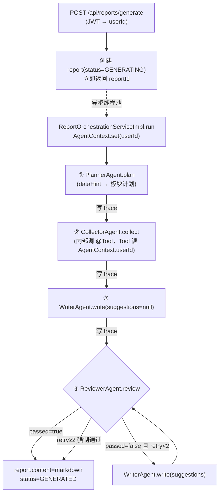

# DayFlow M3 多智能体核心设计

> 日期：2026-07-09
> 里程碑：M3（多智能体核心）
> 上游 spec：`docs/superpowers/specs/2026-07-07-dayflow-ai-report-design.md`（整体架构与 4 Agent 权威设计）
> 上游 spec：`docs/superpowers/specs/2026-07-08-dayflow-m2-spring-ai-design.md`（Spring AI 2.0 接入、`ChatClient` 地基）
> 上游 spec：`docs/superpowers/specs/2026-07-08-dayflow-m1-data-layer-design.md`（数据层基线、`ResultCode`、JWT、`UserContext`）
> 下游：`writing-plans` 据此细化为 TDD task

---

## 1. 目标与范围

M3 在 M2 的 `ChatClient` 地基上，落地**编辑部模式 4 Agent 协作 + 反馈循环**，打通"触发日报生成 → 4 Agent 协作 → 落库 + 轨迹可视化"的核心闭环。这是 DayFlow 的开源核心卖点。

### 1.1 本期交付（核心闭环）

- 4 个 Agent（Planner / Collector / Writer / Reviewer）+ 反馈循环（`MAX_RETRY = 2`）
- Tool Calling：Collector 通过 `@Tool` 调业务数据（activity / task / note 直接查表）
- 结构化输出：Agent 间以结构化对象传递数据（`.entity()`）
- `agent_trace` 写入：每步 Agent 输入/输出摘要/token/耗时/重试落库，供前端可视化协作过程
- 日报生成端点：异步触发 + 前端轮询（report 状态 + 轨迹）
- **ownership guard 修复**（M1 遗留安全债）：4 个 Service 的按-id 操作加 `userId` 归属校验 + Task `complete` 幂等

### 1.2 明确不做（留后续里程碑）

- **笔记 RAG 语义检索**（Redis 向量库 + embedding）→ 后续里程碑（M3 核心闭环跑通后再加；Collector 的 `searchNotes` 暂走 LIKE 关键词/标签匹配）
- **周报生成**（复用本周日报作素材）→ 后续里程碑（本期只做日报 DAILY）
- SSE / WebSocket 流式轨迹推送 → M4/M5（本期前端轮询足够）
- Git 提交记录数据源 → 后续版本（上游 spec 已明确延后）
- per-Agent 独立重试（反馈循环已覆盖 Writer/Reviewer，单次结构化解析失败直接整轮 FAILED）

> ⚠️ 前置依赖：默认 provider 为 DeepSeek 云端，**开发者需自备 `DEEPSEEK_API_KEY`** 才能跑 live 端到端；CI 走 mock 不受影响（沿用 M2）。

---

## 2. 技术基线（复用 M1/M2）

| 组件 | 版本 / 来源 | 说明 |
|------|------|------|
| Spring Boot | 4.1.0（M1 就位） | Java 21 |
| Spring AI | 2.0.0（M2 就位） | `ChatClient` / `.entity()` / `@Tool` / `ChatResponse.metadata().usage()` |
| `ChatClient` bean | M2 `AiConfig#chatClient` | M3 在此基础上建 4 个**专属** ChatClient（各自 `defaultSystem`） |
| 数据层 | M1 6 表 + Mapper + Service | activity / task / note / report / agent_trace 复用 |
| 鉴权 | M1 JWT（`JwtInterceptor` + `UserContext`） | `/api/reports/**` 自动落入 `/api/**` 拦截；`UserContext.getUserId()` 拿当前用户 |
| 统一响应 | M1 `Result<T>` / `ResultCode` / `GlobalExceptionHandler` | 越权用 `FORBIDDEN=403`；LLM 异常用 `SYSTEM_ERROR=500` |
| 枚举 | M1 `AgentName` / `ReportStatus` / `ReportType` | 直接复用 |
| 测试基建 | M1/M2 Mockito + byte-buddy-agent + `@WebMvcTest` 切片 + live 门控 | 沿用 |

---

## 3. 整体架构与包结构

### 3.1 M3 新增包（全部在 `com.dayflow.agent` 下）

```
agent/
├── orchestration/
│   ├── ReportOrchestrationService.java         # 接口（对外 Service，接口/实现分离）
│   ├── ReportOrchestrationServiceImpl.java     # 编排：串 4 Agent + 反馈循环 + 落库 + 写轨迹
│   ├── AgentContext.java                        # ThreadLocal<userId>：Tool 安全读取，LLM 不接触 userId
│   └── AgentExecutorConfig.java                 # 专用线程池 dayflow-agent-executor
├── planner/PlannerAgent.java                    # plan(PlanInput) → ReportPlan
├── collector/CollectorAgent.java                # collect(ReportPlan, dateRange) → CollectedMaterial
├── writer/WriterAgent.java                      # write(plan, material, suggestions?) → DraftReport
├── reviewer/ReviewerAgent.java                  # review(draft, material) → ReviewResult
├── tools/ReportDataTools.java                   # @Tool：listActivities / listCompletedTasks / searchNotes
├── model/                                       # Agent 间协议对象（非 pojo 层，不带 Entity/DTO/VO 后缀）
│   ├── PlanInput.java
│   ├── ReportPlan.java、PlanSection.java
│   ├── CollectedMaterial.java、CollectedSection.java、CollectedItem.java
│   ├── DraftReport.java、DraftSection.java
│   ├── ReviewResult.java、ReviewIssue.java
│   └── ActivityItem.java、TaskItem.java、NoteItem.java   # Tool 返回的轻量视图
└── config/AgentChatClientConfig.java            # 4 个专属 ChatClient bean，各自 defaultSystem(prompt)
```

另在 `service/` 下新增：
- `AgentTraceService` + `impl/AgentTraceServiceImpl`：把每步 Agent 轨迹落 `agent_trace` 表。
- `pojo/dto/ReportGenerateDTO`：`{type, date}`，generate 端点入参。

### 3.2 编排流程



### 3.3 三个关键设计判断

1. **Agent 不抽统一接口**。4 个 Agent 输入输出类型各异，强抽泛型接口反而绕；它们是编排层的内部协作者（非对外 Service），各为独立 `@Component`。仅 `ReportOrchestrationService` / `AgentTraceService` 走"接口 + 实现分离"（对外 Service，受项目规范约束）。

2. **userId 经 `AgentContext`(ThreadLocal) 传给 Tool，LLM 全程不接触 userId**。绝不让 LLM 决定查谁的数据（幻觉 → 越权）。异步线程把 `userId` 作为方法参数带入 → `run` 方法体内 `AgentContext.set(userId)` → Tool 同线程 `get()` → `finally` `clear()`。

3. **Agent 协议对象放 `agent/model/`，不带 `Entity/DTO/VO` 后缀**。它们是 Agent 之间的内部协议（如 `ReportPlan` / `CollectedMaterial`），不是表实体也不是 Controller 入参/出参，不属于 `pojo/` 命名规范范畴；强行套后缀会扭曲语义。沿用上游 spec 第 5 节命名。

---

## 4. 4 Agent 规格与数据对象

### 4.1 Agent 间协议对象（`agent/model/`，Lombok `@Data`）

| 对象 | 字段 | 产出方 |
|---|---|---|
| `PlanInput` | `userId:Long, date:LocalDate, reportType:ReportType, dataHint:String` | 编排层（先 count 各源条数填 `dataHint`） |
| `ReportPlan` | `title:String, sections:List<PlanSection>` | Planner |
| `PlanSection` | `name:String, dataSource:DataSource, focus:String` | Planner |
| `CollectedMaterial` | `sections:List<CollectedSection>` | Collector |
| `CollectedSection` | `sectionName:String, items:List<CollectedItem>` | Collector |
| `CollectedItem` | `source:String, summary:String, ref:String` | Collector 归纳 |
| `DraftReport` | `title:String, sections:List<DraftSection>` | Writer |
| `DraftSection` | `name:String, content:String`（该板块中文 markdown） | Writer |
| `ReviewResult` | `passed:boolean, issues:List<ReviewIssue>, suggestions:String` | Reviewer |
| `ReviewIssue` | `section:String, type:ReviewIssueType, description:String` | Reviewer |

新增枚举（`agent/model/` 或 `pojo/enums/`）：
- `DataSource`：`ACTIVITY` / `NOTE` / `TASK`
- `ReviewIssueType`：`OVERCLAIM`（夸大/无依据）/ `REDUNDANT`（板块间重复）/ `MISSING`（板块未覆盖）/ `TONE`（语气不当）

### 4.2 4 Agent system prompt 要点

| Agent | 角色定位 | 核心约束 |
|---|---|---|
| **Planner**（主编） | 据当天数据规划日报板块 | 板块 2–4 个；每板块指定数据源 + 重点；标题"YYYY-MM-DD 工作与学习日报"；**`dataHint` 全 0 → 产出"今日暂无记录"单板块** |
| **Collector**（记者） | 按板块调工具采集、去重归类 | **必须调工具拉真实数据，禁止编造**；按板块归类；每条素材出摘要；某源为空则该板块标注"无记录" |
| **Writer**（撰稿） | 把素材写成通顺中文段落 | 严格按板块结构；**每段须有素材依据，不臆造/不夸大**；客观专业不啰嗦；有 `suggestions` 则据此改 |
| **Reviewer**（审校） | 质检草稿 | 四维校验：①素材依据 ②去重 ③板块完整 ④语气；未通过给具体修改建议 |

### 4.3 Spring AI 调用范式

| Agent | 手法 |
|---|---|
| Planner | `plannerChatClient.prompt().system(...).user(planInputAsText).call().entity(ReportPlan.class)` |
| Collector | `collectorChatClient.defaultTools(reportDataTools).prompt().user(...).call().entity(CollectedMaterial.class)`（两段式，见 4.5） |
| Writer | `writerChatClient.prompt().user(...).call().entity(DraftReport.class)` |
| Reviewer | `reviewerChatClient.prompt().user(...).call().entity(ReviewResult.class)` |

`AgentChatClientConfig` 在 M2 的 `ChatClient` bean 之外，基于同一 `ChatModel` 建 4 个专属 bean：

```java
@Configuration
public class AgentChatClientConfig {

    @Bean(name = "plannerChatClient")
    public ChatClient plannerChatClient(ChatModel chatModel) {
        return ChatClient.builder(chatModel).defaultSystem(PLANNER_PROMPT).build();
    }
    // collectorChatClient / writerChatClient / reviewerChatClient 同理，各自 PROMPT
}
```

### 4.4 ReportDataTools（注册给 Collector 的 `@Tool`）

```java
/**
 * 报告数据采集工具，注册给 Collector Agent
 * <p>userId 一律从 {@link AgentContext} 读取（后端掌控），LLM 全程不接触 userId，
 * 杜绝 LLM 幻觉导致越权拉取他人数据。</p>
 *
 * @author jiaxianming
 */
@Component
@RequiredArgsConstructor
public class ReportDataTools {

    private final ActivityMapper activityMapper;
    private final TaskMapper taskMapper;
    private final NoteMapper noteMapper;

    /**
     * 查询指定日期范围内用户的工作活动记录
     */
    @Tool(description = "查询指定日期范围内用户的工作活动记录（含分类与发生时间）")
    public List<ActivityItem> listActivities(String startDate, String endDate) {
        Long userId = AgentContext.getUserId();
        // 按 userId + occurred_at 范围查 activity 表，映射为轻量 ActivityItem
    }

    /**
     * 查询指定日期范围内已完成的任务
     */
    @Tool(description = "查询指定日期范围内已完成的任务")
    public List<TaskItem> listCompletedTasks(String startDate, String endDate) { ... }

    /**
     * 按关键词检索学习笔记（M3 无 RAG，走 LIKE 关键词/标签匹配）
     */
    @Tool(description = "按关键词检索学习笔记（标题/内容/标签匹配）")
    public List<NoteItem> searchNotes(String keywords, String startDate, String endDate) { ... }
}
```

- `ActivityItem` / `TaskItem` / `NoteItem` 为**轻量 record**（只含 `content/title/category/tags/occurredAt` 等 LLM 所需字段），**不直接用 VO**——避免把 `id` / `userId` 等内部字段塞给 LLM（省 token、防混淆、防泄露）。
- `searchNotes` 在 M3 走 **LIKE 关键词/标签匹配**（无 RAG）；RAG 留后续里程碑。
- Tool 直接注入 Mapper 查询（精确按 `userId` + 日期范围），不走 Service。

### 4.5 Collector 两段式（M3 技术 spike 点）

Collector 要"调工具拉数据 + 归纳成结构化素材包"。设计为**一次调用带 `.defaultTools(tools)` + `.entity(CollectedMaterial.class)`**：LLM 自主调工具取数 → 同一轮产出结构化 `CollectedMaterial`。

> ⚠️ Spring AI 2.0 的「Tool Calling + 结构化输出」组合能否稳定一次完成，需在 plan 的首个 Collector task 里 spike 验证。**Fallback**：拆两步——先带工具调一次拿原始数据，再无工具结构化归纳。此不确定性列入第 11 节风险表，不阻塞设计。

---

## 5. 编排、异步、入口与轨迹

### 5.1 触发入口（异步模式）

| 端点 | 行为 |
|---|---|
| **新增** `POST /api/reports/generate` | body `{type:"DAILY", date:"2026-07-09"}` → 同步创建 report(status=GENERATING) + 提交异步编排 + **立即返回 `reportId`** |
| `GET /api/reports/{id}` | 前端轮询看 `status`（GENERATING→GENERATED/FAILED） |
| `GET /api/reports/{id}/traces` | 前端轮询看 4 Agent 协作过程（轨迹渐进出现） |
| M1 的 `POST /api/reports`（仅元信息） | **保留不动**，避免破坏；report 主流程改由 generate 驱动 |

### 5.2 ReportOrchestrationService（接口 + 实现分离）

```java
public interface ReportOrchestrationService {

    /**
     * 触发报告生成：创建 report(GENERATING) + 提交异步编排 + 立即返回 reportId
     */
    Long generate(ReportGenerateDTO dto);

    /**
     * 异步线程内执行 4 Agent 编排（由专用线程池驱动，不对外暴露）
     */
    void run(Long reportId, Long userId, LocalDate date, ReportType type);
}
```

### 5.3 异步实现选型

用**专用线程池 `dayflow-agent-executor` + `executor.execute(...)` 手动提交**，**不用 `@Async`**。

> 理由：`@Async` 同类自调用不生效是经典坑；手动提交更显式、可控（线程池大小、队列、拒绝策略），异常只在 `run` 内 catch，不污染调用方。

`AgentExecutorConfig` 配 `ThreadPoolTaskExecutor`：core=2 / max=4 / queue=10 / 线程名 `agent-`。报告生成是重任务，单用户低并发，足够；高并发留 M5。

### 5.4 编排骨架（run 方法核心逻辑）

```java
public void run(Long reportId, Long userId, LocalDate date, ReportType type) {
    AgentContext.set(userId);                       // Tool 经此读 userId，LLM 不接触
    int totalTokens = 0;
    try {
        // 1. 规划（编排层先 count 各源条数填 dataHint）
        ReportPlan plan = planner.plan(buildPlanInput(userId, date, type));
        totalTokens += plan.tokens();
        trace(reportId, AgentName.PLANNER, step++, plan);

        // 2. 采集
        CollectedMaterial material = collector.collect(plan, date);
        trace(reportId, AgentName.COLLECTOR, step++, material);

        // 3. 撰写 + 审校（反馈循环，最多 MAX_RETRY 次）
        DraftReport draft = writer.write(plan, material, null);
        trace(reportId, AgentName.WRITER, step++, draft, 0);

        int retry = 0;
        while (retry < MAX_RETRY) {                 // MAX_RETRY = 2
            ReviewResult review = reviewer.review(draft, material);
            trace(reportId, AgentName.REVIEWER, step++, review, retry);
            if (review.isPassed()) break;
            retry++;
            draft = writer.write(plan, material, review.getSuggestions());
            trace(reportId, AgentName.WRITER, step++, draft, retry);
        }
        // 4. 落库（单独事务）
        finalizeReport(reportId, draft, totalTokens);   // status=GENERATED, content=toMarkdown(draft)
    } catch (Exception e) {
        markFailed(reportId, e);                        // status=FAILED, error_msg
    } finally {
        AgentContext.clear();
    }
}
```

`generate` 同步部分：从 `UserContext` 拿 `userId` → 构造 `ReportCreateDTO`（type/periodStart=periodEnd=date）→ `reportService.create(dto)` 拿 `reportId`（status=GENERATING）→ `agentExecutor.execute(() -> run(reportId, userId, date, type))` → 返回 `reportId`。

### 5.5 agent_trace 写入（`AgentTraceService`）

- `trace(reportId, agent, step, inputSummary, outputSummary, tokens, latencyMs, retryCount)` —— 每步 Agent 调用后落库（复用 `AgentTraceMapper`）；`step` 从 1 开始按执行顺序递增。
- **摘要**：输入/输出对象 JSON 序列化后截断（如前 500 字），不全量存（控字段长度、控 token）。
- **token / latency**：Agent 调用时围绕测 latency；token 从 `ChatResponse.metadata().usage()` 提取，累加进 `report.token_usage`。
- **事务边界**：trace 每步**独立小事务**（前端轮询能渐进看到轨迹）；report 最终落库**单独事务**。**绝不用一个大事务包整个 `run`**（几十秒 + LLM 调用不该在事务内）。

---

## 6. ownership guard 修复（M1 安全债并入 M3）

所有"按 id 操作单资源"的入口加归属校验，`userId` 取自 `UserContext`，不符 → `BusinessException(ResultCode.FORBIDDEN)` → 403：

| Service | 加校验的方法 | 校验逻辑 |
|---|---|---|
| ReportService | `getById` / `delete` / `listTraces` | 查 report，`report.userId != ctx.userId` → 403 |
| ActivityService | `getById` / `update` / `delete` | 查 activity 归属 |
| NoteService | `getById` / `update` / `delete` | 查 note 归属 |
| TaskService | `getById` / `update` / `delete` / **`complete`** | 查 task 归属；**`complete` 幂等：已 DONE 直接返回成功** |

> `page` 类查询确认已按 `userId` 过滤（M1 应已做，T 阶段核对，缺则补）。`create` 类操作确认 `userId` 取自 `UserContext`（非前端传入）。

---

## 7. 错误处理（三态覆盖）

| 场景 | 处理 | report.status |
|---|---|---|
| 正常 | 4 Agent 协作，Reviewer 通过（或 retry≥2 强制通过） | `GENERATED` |
| 当天无记录（空数据） | Planner 产"今日暂无记录"单板块 → Collector 全空 → Writer 简短说明 → Reviewer 通过 | `GENERATED`（轻量模板） |
| LLM 调用失败/超时 | Spring AI 内置 retry 兜底；仍失败 → `run` catch → FAILED + error_msg | `FAILED` |
| 单个 Tool 异常 | **Tool 内部 catch → 返回空 + log**，Collector 标该板块"无记录"，整体继续 | `GENERATED`（部分板块无记录） |
| 结构化输出解析失败 | `run` catch → FAILED + error_msg（M3 不做 per-Agent 重试；反馈循环已覆盖 Writer/Reviewer） | `FAILED` |
| 异步线程异常 | `run` try-catch 兜底，不泄漏到容器；report=FAILED | `FAILED` |
| 越权操作 | `BusinessException(FORBIDDEN)` → `GlobalExceptionHandler` → 403 | —（HTTP 403） |
| 参数缺失/非法 | `@Valid` → `GlobalExceptionHandler` 校验分支 → 400 | —（HTTP 400） |

> 设计原则：4 Agent 是流水线，**中间步失败 = 整轮 FAILED**（不产出半成品报告）；唯一例外是 Tool 单源失败（降级为该板块"无记录"），因为素材缺失不致命。

> 空数据说明：当天无记录时**仍走完整 4 Agent 流程**（Planner 据全 0 的 `dataHint` 产单板块计划 → Collector 调工具全空 → Writer 写简短说明 → Reviewer 通过），`content` 由 LLM 生成、**非硬编码模板**。

---

## 8. 测试策略（沿用 M2 mock 手法 + live 门控）

| 测试 | 手段 | 覆盖点 |
|---|---|---|
| **`ReportOrchestrationServiceImplTest`**（最重要） | mock 4 Agent + AgentTraceService + reportService + executor（同步执行） | ①主流程 passed=true ②Reviewer 打回 → 返工 → 通过 ③retry≥2 强制通过 ④空数据走轻量模板 ⑤异常 → FAILED ⑥`AgentContext.userId` 正确传到 Tool |
| 各 Agent 单测 | `@Mock(RETURNS_DEEP_STUBS) ChatClient` 桩 `.entity()` 链 | 调用正确 + 结构化对象映射 |
| `ReportDataToolsTest` | mock Mapper | 按 `AgentContext.userId` 查询；userId 缺失时安全降级（返回空） |
| ownership guard 测试 | 各 `ServiceTest` | 越权 → 403；Task `complete` 幂等（已 DONE 直接成功） |
| `ReportControllerTest` | `@WebMvcTest` + `@MockitoBean` | `generate` 200 返回 id / 越权 403 / 参数缺失 400 |
| `AgentTraceServiceTest` | mock Mapper | trace 字段（step/tokens/latency/retry）落库正确 |
| **Live 冒烟（门控）** | `@EnabledIfEnvironmentVariable(DEEPSEEK_API_KEY)` | 真实生成：status=GENERATED + 4+ 条 trace + content 非空可读 |

- 单测**全部 mock**：CI 不连真模型、不花钱、不依赖网络（同 M2）。
- byte-buddy-agent javaagent 已在 `pom.xml`（M1 修复），Mockito 在 JDK21 沙箱下正常。
- 编排层测试用同步 executor（`Runnable::run` 直接执行），保证单测内异步可断言。

---

## 9. 验收标准

1. `mvn clean test` 全绿（mock 测试，不连真模型）。
2. 配 `DEEPSEEK_API_KEY` 跑 live 冒烟：`POST /api/reports/generate` → `reportId` → 轮询 `GET /{id}` 到 `GENERATED` + `GET /{id}/traces` 见 4+ 条 Agent 轨迹 + content 可读。
3. ownership guard：A 用户 token 操作 B 用户资源 → 403。
4. 空数据：无记录日期生成 → 仍走完整 4 Agent 流程、LLM 产出简短说明（status=GENERATED，非硬编码模板）。
5. Task `complete` 幂等：重复 complete 已 DONE 任务不报错。

---

## 10. 任务预览（`writing-plans` 据此细化为 TDD task）

每个 task：红 → 绿 + feature 分支 task 级提交（review 所需、可 reset）。

- **T0** ownership guard + Task `complete` 幂等（4 Service 加 userId 校验 + 补测试）—— 先堵安全债
- **T1** Agent 骨架：`AgentContext` + `AgentExecutorConfig` + `AgentChatClientConfig`（4 ChatClient）+ `AgentTraceService` + 协议对象/枚举
- **T2** Planner（`PlannerAgent` + `ReportPlan` 结构化输出，含空数据模板）+ Collector 两段式 spike
- **T3** `ReportDataTools`（`@Tool` 三方法，userId 从 `AgentContext`）+ `CollectorAgent`
- **T4** `WriterAgent` + `ReviewerAgent` + 反馈循环（单测 mock 验证主流程/回退/强制通过）
- **T5** `ReportOrchestrationService` 编排 + 异步线程池 + `POST /api/reports/generate` 端点 + 三态错误处理
- **T6** 收尾：`mvn clean test` 全绿 + live 冒烟（可选）+ 端到端四态验证 + tag `m3-complete`

---

## 11. 风险与 fallback

| 风险 | 应对 |
|------|------|
| Spring AI 2.0「Tool Calling + 结构化输出」组合不稳 | Collector 两段式 plan 首 spike；fallback 拆两步（先工具取数，再结构化归纳） |
| DeepSeek `.entity()` 结构化输出偶发不合规 | `run` catch → FAILED；prompt 加严格输出约束 + few-shot 示例（plan 阶段调） |
| 异步线程池资源 | M3 单用户低并发，core=2/max=4/queue=10 足够；高并发留 M5 |
| `ChatResponse.metadata().usage()` 在 2.0 的取值路径 | T1 验证 token 提取；取不到时 trace.tokens 留空、不影响主流程 |
| Live 测试花钱/需 key | CI 走 mock；live 门控 `@EnabledIfEnvironmentVariable`，合并前手动跑（同 M2） |
| Boot 4.x 切片测试已知坑 | 沿用 M1/M2 范本（`@MockitoBean`、排除 `WebConfig`、`@MapperScan` 独立 config） |

---

## 12. 与上游 spec 的差异说明

1. **范围切片**：上游 spec 第 5 节含 RAG 语义检索 + 周报；本期（M3）经 brainstorming 确认**只做核心闭环**（4 Agent + 反馈循环 + Tool Calling + agent_trace + 日报），RAG 与周报推迟到后续里程碑，以控制风险、先验证多智能体架构。`searchNotes` 暂走 LIKE 关键词/标签匹配。
2. **执行模式**：上游 spec 第 5.3 节伪代码为同步 `generateDailyReport`；本期改为**异步 + 前端轮询**（report.status + agent_trace 天然契合），避免 HTTP 长连接超时、支撑协作过程可视化。
3. **Spring AI 版本**：上游 spec 基于 Spring AI 1.0 编写，M2 已升级到 2.0 GA；本 spec 所有 Spring AI 代码示例以 2.0 为准（`ChatClient.builder` / `.entity()` / `.defaultTools()` / `@Tool`）。
4. **安全债并入**：M1 遗留的横向越权问题（记忆登记为 M3 入场任务）并入本期 T0 修复，不另立里程碑。
