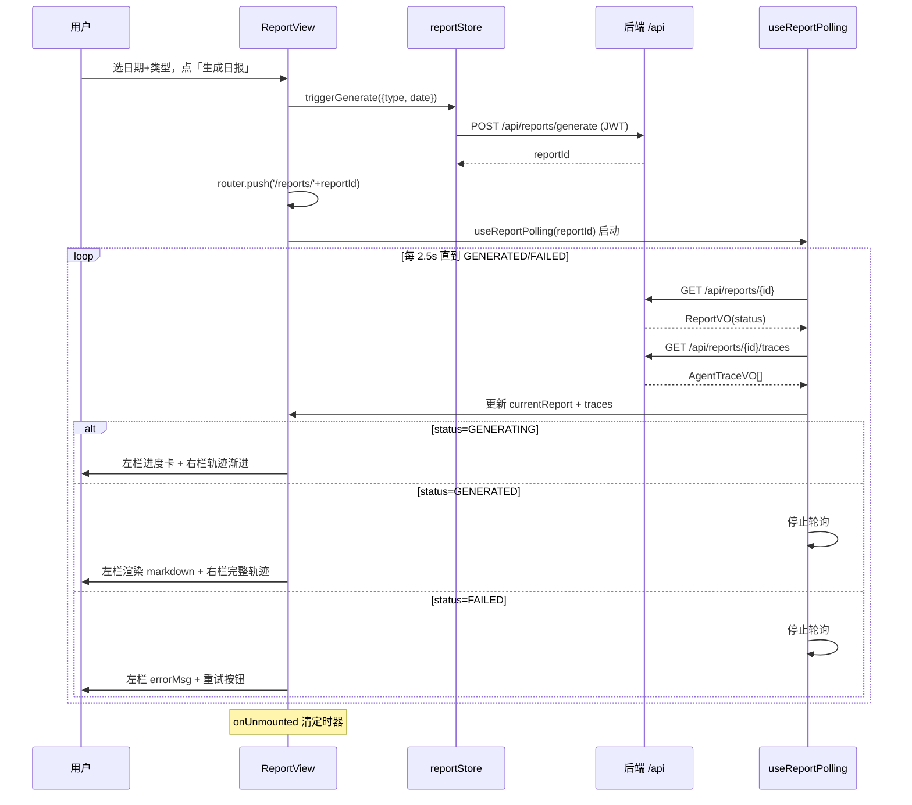

# DayFlow M4 前端 Web 设计

> 日期：2026-07-10
> 里程碑：M4（前端 Web）
> 上游 spec：`docs/superpowers/specs/2026-07-07-dayflow-ai-report-design.md`（整体架构与 4 Agent 权威设计）
> 上游 spec：`docs/superpowers/specs/2026-07-09-dayflow-m3-multi-agent-design.md`（M3 多智能体核心、异步生成契约、agent_trace）
> 上游需求：`docs/requirements/周报生成器需求整体文档.txt`（产品愿景，含周报/数据源等产品意图）
> 下游：`writing-plans` 据此细化为 TDD task

---

## 1. 目标与范围

M4 在 M3 后端多智能体核心之上，落地 **Vue3 前端 Web**，打通「录入数据 → 触发生成 → 查看 Markdown 报告 + Agent 协作时间线」的端到端可用闭环。这是 DayFlow 从「后端可调」到「产品可用」的关键里程碑。

### 1.1 本期交付

- **登录 + 注册**：JWT 鉴权前端（登录页/注册页/路由守卫/JWT 拦截器）+ **后端补注册端点** `POST /api/auth/register`（前后端联动）
- **数据录入页**：Activity / Note / Task 三 tab CRUD（对接 M1 三个资源的 CRUD + Task complete）
- **报告生成与查看页**：触发 `POST /api/reports/generate` → 异步轮询 `status` + `agent_trace` → 双栏展示（左 Markdown 正文 + 右 Agent 协作时间线），覆盖 GENERATING / GENERATED / FAILED 三态
- **Agent 协作时间线可视化**（开源卖点）：垂直时间轴渲染 4 Agent（Planner/Collector/Writer/Reviewer）的 step 序列、输入输出摘要、token/耗时、返工重试
- **历史报告列表页**：分页查看历史报告，跳转详情
- **侧边栏导航布局**：Element Plus 默认主题，CSS 变量预留主题切换

### 1.2 明确不做（留后续里程碑）

- **AI 对话页**（`POST /api/ai/chat`，M2 已通但非核心卖点）→ 后续
- **设置页**（LLM provider 运行时切换）→ 后端 LLM 配置为启动环境变量，运行时切换需后端补接口，超 M4 范围
- **周报生成入口**→ 后端 `WEEKLY` 枚举已定义但运行时只走 DAILY，前端**不**预留入口（避免误导，待后端周报逻辑就绪再做）
- **E2E 测试**（Playwright/Cypress）→ 留 M5
- **暗色模式 / 国际化 / 移动端适配**→ 后续
- **笔记 RAG 语义检索前端**→ 接口透明（后端 `searchNotes` 走 LIKE），前端无特殊处理

### 1.3 关键约束（来自后端契约梳理）

| 约束 | 处理 |
|---|---|
| ⚠️ **无注册端点**（M3 仅 `login`） | M4 补后端 `POST /api/auth/register` + 前端注册页 |
| ⚠️ **雪花 ID 精度**（19 位 > JS Number 16 位） | **后端保留 Long 类型**（不改序列化契约）；前端 axios `transformResponse` + `json-bigint`（`storeAsString: true`），`id/userId/reportId` 类型为 `string` |
| 统一响应 `Result<T>`（`code/msg/data`） | axios 响应拦截器按 `code` 分流：200 放行 / 401 跳登录 / 其他 `ElMessage` 提示 |
| 分页 `IPage`（records/total/size/current/pages） | 前端按 IPage 结构解析 `data` |
| 报告异步契约 | `generate` 立即返回 reportId → 前端轮询 `GET /{id}` + `GET /{id}/traces`（2.5s 间隔） |
| 枚举 JSON 序列化为名字符串 | 前端 TS 用字符串字面量联合类型 |

---

## 2. 技术基线

| 组件 | 版本 / 来源 | 说明 |
|------|------|------|
| Vue | 3.x（`<script setup>` Composition API） | 遵循用户级 CLAUDE.md Vue3 规范 |
| TypeScript | 5.x | 显式类型标注，禁滥用 `any` |
| Vite | 5.x | 构建工具，dev server proxy `/api` → `localhost:8080` |
| Pinia | 2.x | 状态管理（auth/report store） |
| Element Plus | 最新稳定 | UI 组件库，默认主题 |
| Vue Router | 4.x | 路由 + 守卫 |
| axios | 1.x | HTTP 客户端，拦截器 + transformResponse |
| markdown-it | 最新 | Markdown → HTML 渲染 |
| DOMPurify | 最新 | 净化 LLM 生成 HTML（防 XSS） |
| json-bigint | 最新 | 雪花 ID 精度安全解析 |
| Vitest + Vue Test Utils | 最新 | 单测（Vite 原生） |
| 后端 | M3 就位（Spring Boot 4.1 / Spring AI 2.0） | M4 仅补注册端点，不动多智能体核心 |

> 包管理用 npm（最通用，开源门槛低）。前端规范遵循用户级 CLAUDE.md §3（命名/目录/Composition API/TS/Pinia/样式）。

---

## 3. 整体架构与目录结构

### 3.1 monorepo 布局

```
DayFlow/
├── dayflow-server/    # 后端（M0-M3 就位）
├── dayflow-web/       # 前端（M4 新建）
├── docs/              # spec/plan/需求
└── init.sql           # M5 示例数据
```

`dayflow-web/` 与 `dayflow-server/` 平级，独立 `package.json`，dev 时 Vite proxy 转发 `/api` 到后端 8080。

### 3.2 前端目录结构（遵循 CLAUDE.md §3.5）

```
dayflow-web/
├── index.html
├── vite.config.ts        # proxy /api → localhost:8080
├── tsconfig.json
├── package.json
└── src/
    ├── api/              # HTTP 请求模块（按业务拆分）
    │   ├── index.ts      # axios 实例 + 请求/响应拦截器 + transformResponse(json-bigint)
    │   ├── auth.ts       # login / register
    │   ├── activity.ts   # Activity CRUD
    │   ├── note.ts       # Note CRUD
    │   ├── task.ts       # Task CRUD + complete
    │   └── report.ts     # generate / get / page / traces
    ├── components/
    │   ├── common/       # 基础通用组件
    │   ├── AgentTimeline.vue      # Agent 协作时间线（核心卖点）
    │   └── MarkdownView.vue       # Markdown 渲染（markdown-it + DOMPurify）
    ├── composables/
    │   └── useReportPolling.ts    # 报告轮询（status + traces，三态，自动清理）
    ├── layouts/
    │   └── AppLayout.vue          # 侧边栏 el-menu + 主区 router-view + 顶部用户信息
    ├── router/
    │   └── index.ts      # 路由表 + beforeEach 守卫
    ├── stores/
    │   ├── auth.ts       # token / userId / nickname + login/register/logout
    │   └── report.ts     # currentReport / traces / isGenerating + triggerGenerate/poll
    ├── types/            # TS 类型（对应后端 DTO/VO/Query/枚举，id: string）
    │   ├── api.ts        # Result<T> / IPage<T>
    │   ├── auth.ts
    │   ├── activity.ts
    │   ├── note.ts
    │   ├── task.ts
    │   ├── report.ts
    │   └── enums.ts      # ReportType / ReportStatus / AgentName / ActivityCategory / TaskStatus
    ├── utils/            # 工具函数（日期格式化等；axios 实例统一放 api/index.ts）
    └── views/
        ├── auth/
        │   ├── LoginView.vue
        │   └── RegisterView.vue
        ├── input/
        │   └── InputView.vue       # el-tabs(Activity/Note/Task)
        ├── report/
        │   └── ReportView.vue      # 双栏：左 MarkdownView + 右 AgentTimeline
        └── history/
            └── HistoryView.vue     # el-table 分页 + 跳详情
```

### 3.3 三个关键设计判断

1. **数据列表不全局 store**。Activity/Note/Task 列表是页面局部状态，跨组件共享需求弱；强行 store 化增加样板。仅 `authStore`（token 全局）与 `reportStore`（报告生成状态跨「触发页→详情页」共享）用 Pinia。列表数据在 view 内 + composable 管理（YAGNI）。

2. **轮询逻辑抽 composable 而非塞进 ReportView**。`useReportPolling(reportId)` 封装「定时轮询 + 三态判定 + onUnmounted 清理 + 重试」，ReportView 只消费返回的响应式状态。便于单测、可复用、视图不臃肿。

3. **Markdown 渲染必经 DOMPurify**。报告 `content` 由 LLM 生成，可能含恶意 markdown/HTML；`markdown-it` 转 HTML 后用 `DOMPurify.sanitize` 净化再注入，防 XSS。

---

## 4. 路由与鉴权

### 4.1 路由表

| 路径 | 组件 | 鉴权 | 说明 |
|---|---|---|---|
| `/login` | LoginView | 公开 | 登录页 |
| `/register` | RegisterView | 公开 | 注册页（M4 新增） |
| `/` | 重定向 → `/input` | — | |
| `/input` | InputView | 需登录 | 数据录入（三 tab） |
| `/reports` | HistoryView | 需登录 | 历史报告列表 |
| `/reports/:id` | ReportView | 需登录 | 报告查看 + Agent 时间线 |
| `*` | NotFound | — | 404 |

### 4.2 路由守卫

`router/index.ts` 的 `beforeEach`：
- 未登录访问需登录页 → 跳 `/login`（带 `redirect` query）
- 已登录访问 `/login` `/register` → 跳 `/input`
- 登录态判定：`authStore.token`（localStorage 持久化）

### 4.3 JWT 拦截（axios）

- **请求拦截器**：从 `authStore.token`（或 localStorage）取 token，注入 `Authorization: Bearer <token>`
- **响应拦截器**：按 `Result.code` 分流
  - `200` → 放行，返回 `data`
  - `401` → 清 token + `ElMessage` 提示 + 跳 `/login`
  - 其他 → `ElMessage.error(msg)`，reject
- **transformResponse**：用 `json-bigint`（`storeAsString: true`）替代默认 `JSON.parse`，雪花 ID 安全转 string

---

## 5. 状态管理（Pinia）

### 5.1 authStore

```ts
// stores/auth.ts
export const useAuthStore = defineStore('auth', () => {
  const token = ref<string>(localStorage.getItem('token') || '')
  const userId = ref<string>('')
  const username = ref<string>('')
  const nickname = ref<string>('')

  const isAuthed = computed(() => !!token.value)

  async function login(dto: LoginDTO): Promise<void> { /* 调 api.auth.login，存 token/userInfo */ }
  async function register(dto: RegisterDTO): Promise<void> { /* 调 api.auth.register，成功即登录 */ }
  function logout(): void { /* 清 token + 跳 /login */ }

  return { token, userId, username, nickname, isAuthed, login, register, logout }
})
```

> token 持久化 localStorage；登录/注册成功后存 token + userInfo。

### 5.2 reportStore

```ts
// stores/report.ts
export const useReportStore = defineStore('report', () => {
  const currentReport = ref<ReportVO | null>(null)
  const traces = ref<AgentTraceVO[]>([])
  const isGenerating = ref(false)

  async function triggerGenerate(dto: ReportGenerateDTO): Promise<string> { /* POST /generate → reportId */ }
  // 轮询细节在 useReportPolling composable
  return { currentReport, traces, isGenerating, triggerGenerate }
})
```

---

## 6. 关键页面与组件规格

### 6.1 AppLayout（侧边栏导航）

- `el-menu` 侧边栏：录入 / 报告 / 历史 三个导航项（`el-menu-item` + 图标）
- 主区：`<router-view>` 渲染当前页
- 顶部/侧边底部：用户昵称 + 登出按钮
- EP 默认主题，CSS 变量预留 `--dayflow-primary` 等主题切换入口

### 6.2 InputView（数据录入，三 tab）

- `el-tabs`：Activity / Note / Task 三个 tab
- 每个 tab 一个独立面板组件（`ActivityPanel.vue` / `NotePanel.vue` / `TaskPanel.vue`，放 `views/input/panels/`）
- 通用结构：`el-table`（分页）+ 「新增」按钮 + 行内操作：Activity/Note = 编辑/删除；Task = 编辑/删除/完成
- 新增/编辑用 `el-dialog` + 表单（`@Valid` 对应前端校验：`@NotBlank` 字段必填）
- Task tab 额外：状态筛选（TODO/DOING/DONE）+ complete 操作（`PATCH /api/tasks/{id}/complete`）

### 6.3 ReportView（报告生成与查看，双栏）

布局：`<el-row :gutter="16">` 左 `:span="15"` + 右 `:span="9"`。

**左栏 MarkdownView**（按 status 切换）：
- `GENERATING`：进度卡（el-card + el-skeleton / 步骤提示「4 Agent 协作中…」+ 当前已产出步骤数）
- `GENERATED`：`MarkdownView` 渲染 `report.content`（markdown-it + DOMPurify）
- `FAILED`：`el-result` 错误展示 `errorMsg` + 「重新生成」按钮（再调 generate）

**右栏 AgentTimeline**：见 6.4。

**生成触发区**（页面顶部固定）：
- 日期选择器（`el-date-picker`，默认今天）+ 类型选择（DAILY，单选；WEEKLY 不展示）
- 「生成日报」按钮 → `reportStore.triggerGenerate({ type: 'DAILY', date })` → 拿 reportId → `router.push('/reports/' + reportId)`
- 进入 `/reports/:id` 后启动 `useReportPolling(id)`

### 6.4 AgentTimeline（核心卖点组件）

- `el-timeline` 垂直时间轴，按 `step` 升序排列 `AgentTraceVO[]`
- 每个 `el-timeline-item`：
  - 图标/颜色按 `agentName` 区分（PLANNER/COLLECTOR/WRITER/REVIEWER 四色）
  - 标题：`agentName` + `step` +（`retryCount > 0` 时标「返工 #retryCount」徽章）
  - 内容：`inputSummary`（折叠）/ `outputSummary`（折叠）/ `tokens` / `latencyMs`
  - 折叠展开用 `el-collapse`（摘要较长，默认折叠）
- 生成中状态：轨迹渐进出现（轮询返回新 step），最新步骤高亮
- 空轨迹（generate 刚触发）：占位提示「Agent 即将开始协作…」

### 6.5 HistoryView（历史报告列表）

- `el-table`：列 = 标题 / 类型 / 周期 / 状态 / token / 创建时间 / 操作
- 状态列用 `el-tag`（GENERATING 灰 / GENERATED 绿 / FAILED 红）
- 分页：`el-pagination`，对接 `GET /api/reports?type=&page=&size=`
- 操作：「查看」跳 `/reports/:id`、「删除」（`DELETE /api/reports/{id}`，二次确认）

### 6.6 LoginView / RegisterView

- LoginView：用户名 + 密码表单 → `authStore.login` → 成功跳 `redirect` 或 `/input`
- RegisterView：用户名 + 密码 + 确认密码 → `authStore.register` → 成功即登录（后端 register 返回 `LoginVO`）→ 跳 `/input`
- 表单前端校验：用户名/密码非空，密码确认一致

---

## 7. 数据流：报告生成异步闭环



**轮询参数**：间隔 2500ms；停止条件 `status === 'GENERATED' || 'FAILED'`；组件卸载清 `clearInterval`。

---

## 8. 雪花 ID 精度处理

**决策：后端保留 Long 类型**（不补 Jackson Long→String 序列化，M1-M3 API 契约不变）。

前端处理：
```ts
// api/index.ts
import JSONBig from 'json-bigint'

const axiosInstance = axios.create({
  baseURL: '/api',
  transformResponse: [(data) => {
    if (!data) return data
    try { return JSONBig({ storeAsString: true }).parse(data) }
    catch { return JSON.parse(data) }
  }],
})
```

- `storeAsString: true`：超过 `Number.MAX_SAFE_INTEGER` 的整数解析为 string
- 前端 `types/` 中所有 id 类字段（`id`/`userId`/`reportId`/`agentTraceId`）类型为 `string`
- 请求体一般不含前端生成的 Long（id 均后端生成返回），无需特殊处理请求序列化
- 涉及 id 拼路径（`/reports/${id}`）天然兼容 string

---

## 9. 后端注册端点（M4 前后端联动）

M3 仅有 `login`，M4 补注册端点（TDD，沿用 M1 范式）。

### 9.1 端点

| 方法 | 路径 | 入参 | 出参 | 鉴权 |
|---|---|---|---|---|
| POST | `/api/auth/register` | `RegisterDTO` | `Result<LoginVO>` | 公开 |

### 9.2 RegisterDTO

| 字段 | 类型 | 校验 |
|---|---|---|
| username | String | `@NotBlank` |
| password | String | `@NotBlank` |

### 9.3 UserAuthService.register 逻辑

1. 按 `username` 查重 → 已存在抛 `BusinessException(BUSINESS_ERROR, "用户名已存在")` → 409
2. `BCrypt` 加密 password
3. `insert` UserEntity（status 默认正常）
4. 签发 JWT，返回 `LoginVO`（token + userId + username + nickname）—— **注册即登录**，前端无需二次登录

### 9.4 配套改动

- `WebConfig`：放行 `/api/auth/register`（与 `/api/auth/login` 同列）
- 测试：`UserAuthServiceImplTest` 补 register 成功 / 用户名重复 / 密码加密 校验用例；`AuthControllerTest` 补 register 端点切片测试

> 不引入 `UserController`（用户管理超范围）；注册是 auth 域的伴生功能，放 `AuthController` + `UserAuthService`。

---

## 10. 错误处理与三态覆盖

| 场景 | 处理 |
|---|---|
| 正常请求 | `code=200`，放行 `data` |
| 未认证（401） | 清 token + `ElMessage.warning('请重新登录')` + 跳 `/login` |
| 越权（403） | `ElMessage.error(msg)` |
| 参数校验失败（400） | `ElMessage.error(msg)`（后端聚合字段错误） |
| 资源不存在（404） | `ElMessage.error(msg)` |
| 业务冲突（409，如用户名已存在） | `ElMessage.error(msg)` |
| 系统异常（500） | `ElMessage.error('系统异常，请稍后重试')` |
| 网络错误/超时 | axios catch → `ElMessage.error('网络异常')` |
| 报告生成 FAILED | ReportView 左栏显 `errorMsg` + 重试按钮 |
| 报告空数据 | status=GENERATED，content 为 LLM 简短说明，正常渲染（前端无特殊处理） |
| 列表空数据 | `el-empty` 占位 |
| 轮询中组件卸载 | `onUnmounted` 清 `clearInterval`，防内存泄漏 |

---

## 11. 测试策略

| 层 | 工具 | 覆盖点 |
|---|---|---|
| 组件单测 | Vitest + Vue Test Utils | `AgentTimeline` 渲染/排序/返工徽章；`ReportView` 三态切换；`InputView` tab 切换 + 表单校验；`MarkdownView` 渲染 |
| composable 单测 | Vitest + `vi.useFakeTimers` | `useReportPolling` 启动/轮询/三态停止/onUnmounted 清理/重试 |
| API 层单测 | Vitest + axios mock | 拦截器（401 跳登录、token 注入）、transformResponse 大整数转 string |
| store 单测 | Vitest | `authStore` login/register/logout 状态变更 |
| 后端注册端点 | JUnit5 + Mockito（沿用 M1） | `UserAuthServiceImplTest` register 成功/重复/加密；`AuthControllerTest` register 切片 |

- **不做 E2E**（留 M5）
- 单测全部 mock，不连真后端（前端测试独立性）
- 后端注册端点 TDD：红→绿，沿用 M1 `@ExtendWith(MockitoExtension)` + `@WebMvcTest` 范式

---

## 12. 验收标准

1. `npm run build` 成功；`npm run test`（Vitest）全绿
2. 后端 `mvn -f dayflow-server/pom.xml test` 全绿（含新增 register 测试）
3. dev 联调（Vite proxy → 后端）：登录/注册 → 录入 Activity/Note/Task → 生成日报 → 轮询到 GENERATED + content 可读 + 时间线 ≥4 条轨迹
4. 三态：GENERATING 进度 + 轨迹渐进 / GENERATED markdown + 完整轨迹 / FAILED errorMsg + 重试
5. 越权：token 过期/伪造 → 401 跳登录
6. 雪花 ID：报告 id（19 位）前端正确显示/拼路径，无精度丢失
7. 历史报告列表分页 + 跳详情正常
8. 注册：用户名重复 → 409 提示；成功即登录跳 `/input`

---

## 13. 任务预览（writing-plans 据此细化为 TDD task）

每个 task：红 → 绿 + feature 分支 task 级提交（`feature/m4-frontend`）。

- **T1** Vite 脚手架 + EP + Pinia + router + axios 骨架 + vite proxy + 基础 tsconfig/eslint
- **T2** 类型定义（types/，对应后端 DTO/VO/Query/枚举，id: string）+ API 层（api/index.ts 拦截器 + transformResponse json-bigint + auth/activity/note/task/report 模块）
- **T3** 后端注册端点（RegisterDTO + UserAuthService.register + AuthController + WebConfig 放行，TDD）+ 前端鉴权（authStore + LoginView + RegisterView + 路由守卫 + JWT 拦截器）
- **T4** AppLayout 侧边栏导航 + 路由骨架（含 404）
- **T5** 录入页 InputView（Activity/Note/Task 三 tab CRUD + Task complete）
- **T6** 报告页 ReportView（generate 触发 + useReportPolling + 三态 + MarkdownView）
- **T7** AgentTimeline 组件（垂直时间轴 + 轨迹字段 + 返工徽章 + 渐进高亮）
- **T8** 历史报告列表 HistoryView（分页 + 状态 tag + 跳详情 + 删除）
- **T9** 收尾：全量测试（Vitest + mvn test）+ dev 联调验收 + tag `m4-complete`

---

## 14. 风险与 fallback

| 风险 | 应对 |
|---|---|
| json-bigint `transformResponse` 全局解析性能/兼容 | 仅对 `/api` 响应生效；catch 兜底回退 `JSON.parse`；若特定接口异常可针对该接口覆盖 transformResponse |
| LLM 生成 markdown 含恶意脚本 | `markdown-it` 转 HTML 后必经 `DOMPurify.sanitize` |
| 轮询定时器泄漏 | `useReportPolling` 在 `onUnmounted` 清 `clearInterval`；单测验证清理 |
| EP + Vite + Vue3 版本组合坑 | writing-plans 阶段锁定具体版本；沿用官方脚手架 `npm create vue@latest` |
| 后端注册端点引入安全面（弱密码/枚举用户名） | M4 仅做基础（非空 + 查重 + BCrypt）；弱密码策略/限流留后续；不在 spec 过度设计 |
| 前后端联调跨域 | dev 用 Vite proxy 规避；生产部署跨域留 M5（nginx 同源或 CORS） |
| 雪花 ID 前端精度（已决策） | 后端保留 Long，前端 json-bigint 处理；若后续接口增多出现坑，再评估后端 Long→String |

---

## 15. 与上游 spec / 需求文档的差异说明

1. **范围切片**：需求文档设想含周报 + RAG + 设置页；M4 经 brainstorming 确认**只做核心可用闭环**（登录注册 + 录入 + 报告 + 时间线 + 历史列表），周报入口不做（后端未实现，避免误导）、设置页/AI 对话页留后续。
2. **注册端点**：M3 后端仅 login，M4 顺势补 register（前后端联动），注册即登录返回 LoginVO。
3. **雪花 ID**：后端保留 Long（不动 M1-M3 契约），前端 json-bigint 处理精度；与"后端 Jackson Long→String"标准做法不同，权衡是隔离后端改动、避免全局序列化回归。
4. **视觉风格**：需求文档未指定品牌色/设计风格；M4 用 Element Plus 默认主题 + CSS 变量预留，后续可迭代。
5. **不做 E2E**：M4 单测覆盖组件/composable/API/store；E2E 留 M5 开源工程化阶段。
